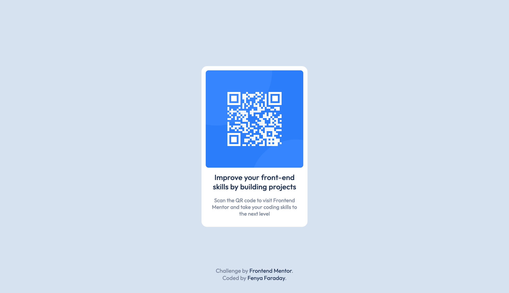

# Frontend Mentor - QR code component solution

This is a solution to the [QR code component challenge on Frontend Mentor](https://www.frontendmentor.io/challenges/qr-code-component-iux_sIO_H). Frontend Mentor challenges help you improve your coding skills by building realistic projects. 

## Table of contents

- [Overview](#overview)
  - [Screenshot](#screenshot)
- [My process](#my-process)
  - [Built with](#built-with)
  - [What I learned](#what-i-learned)
  - [Continued development](#continued-development)
  - [Useful resources](#useful-resources)
- [Author](#author)

## Overview

### Screenshot



## My process

I first structured the html, making sure I have all the elements I dneed in a structured form on my webpage. Then I started with the css, which I included via the _link_-tag. 

In my css I created several definitions for the different elements in my html-file. I tried to make the classes reusable and to name them according to their function.

### Built with

- Semantic HTML5 markup
- CSS custom properties
- CSS Grid
- CSS variables
- [Outfit](https://fonts.google.com/specimen/Outfit) - a Google Font


### What I learned

How to use Grid to center content:

```html
  <div class="container">
    <div class="item">
     [...]
    </div>
  </div>
```
```css
body {
  display: grid;
  place-items: center;
  min-height: 100vw;
}

.container {
  display: inline-block;
}
```

### Continued development

This project is small and might seem benign to more experienced developers. For me, this is the beginning of a journey. I know a few things about working with html, css and js, but I've never had to put my knowledge to the test. I want to improve and be able to create great websites that are fun to interact with and convey exactly what they need to. 

For future projects I want to focus on improving my css. There is a lot to learn and understand, and I haven't got the hang of it quite yet. 

### Useful resources

- [Kevin Powell](https://www.youtube.com/@KevinPowell) - I recently found Kevin's channel on youtube. He breaks down all things css in a very easy to understand manner and I enjoy learning from his videos a lot!

## Author

- Frontend Mentor - [@FenyaFaraday](https://www.frontendmentor.io/profile/FenyaFaraday)